# Step-by-step instructions: Analyzing NF Portal Datasets in Pluto

---

## Step 1: Accept your Pluto invitation

If you have not yet already, [submit this form](https://docs.google.com/forms/d/e/1FAIpQLScmz8wKy6MYsU4xyy4L1n-2qphVqhhZJ_zLcEGWflOKR4LIEA/viewform?usp=dialog) to be invited to the CTF Pluto workspace. 

Be on the lookout for an email from Pluto Bio to accept your invitation. Clicking to accept the invitation will take you to a page to sign up for your temporary 30-day Pluto account. 

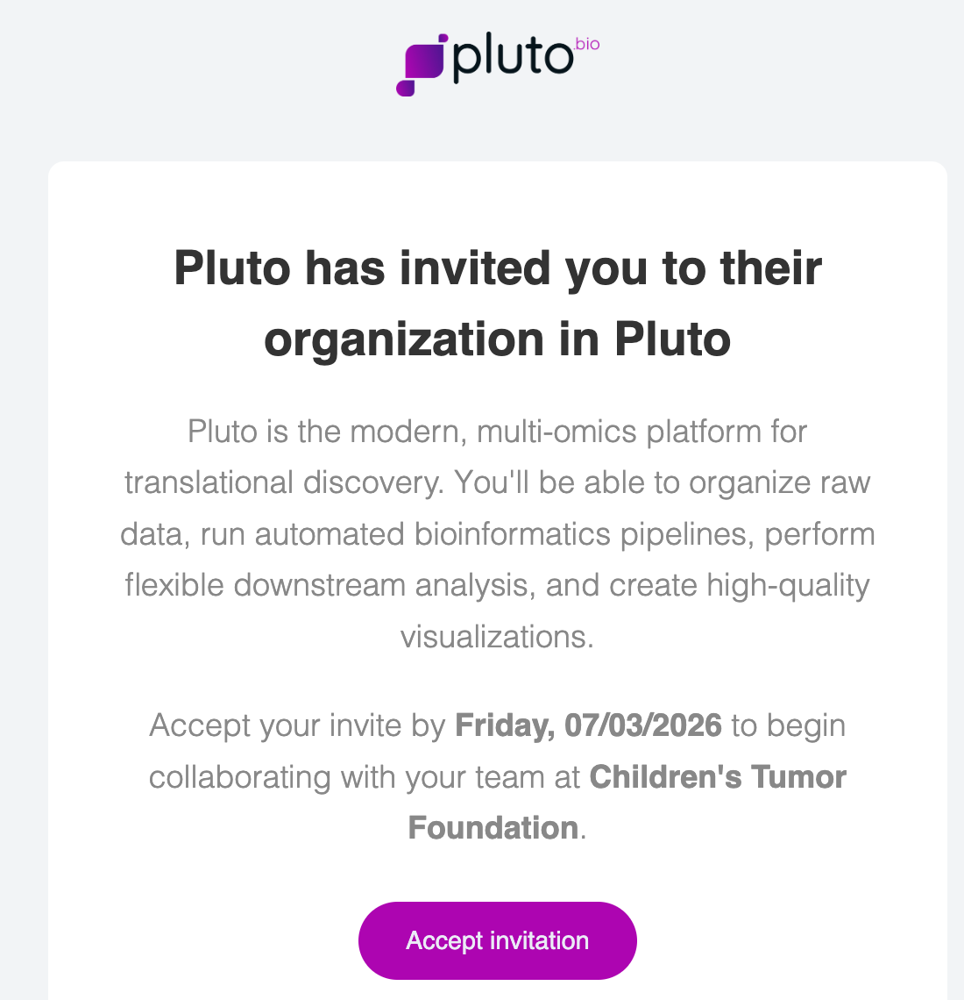

Choose the sign up option and enter your full name and email to create your account. Finally, accept the invitation to join the CTF Pluto workspace. 

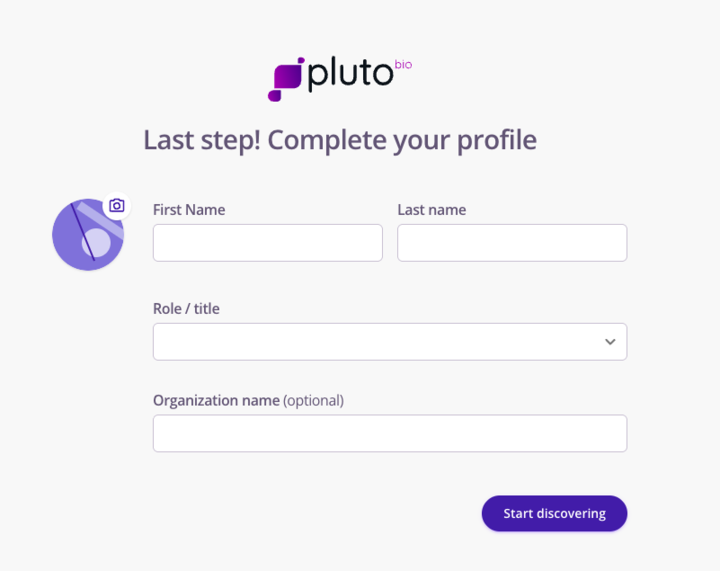 &nbsp;&nbsp;&nbsp; 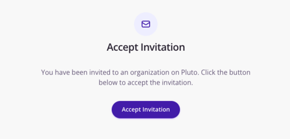

Congratulations, you are now ready to analyze data in Pluto! 

## Step 2: Navigate to the published data sets  

Your user account will be added to the CTF external project shortly. In the meantime, you can explore publicly-available experiments and datasets. 

Use the **Research > Published data sets** tab in the left-hand menu to browse public datasets or use this [link](https://app.pluto.bio/explore?sort_by=-updated_at&page=0).

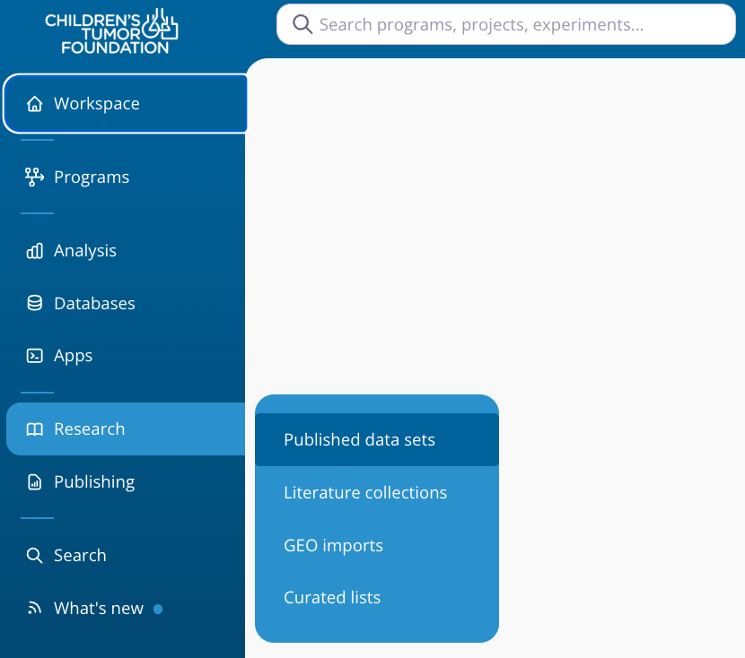

These datasets come from many sources, such as Synapse, GEO, and other public data repositories. You can filter dataset attributes and use the search bar to find specific datasets by keyword. You can see that there are greater than 14,000 datasets now. To demonstrate the dataset attributes, try filtering to just include mouse and RNA-seq experiments. How many datasets remain?  

Now, let's say you have a specific research question in mind related to microglia in Neurofibromatosis (NF). Use the searchbar to search `Neurofibromatosis microglia`. You should find multiple datasets related to this topic that are ready for exploration. 

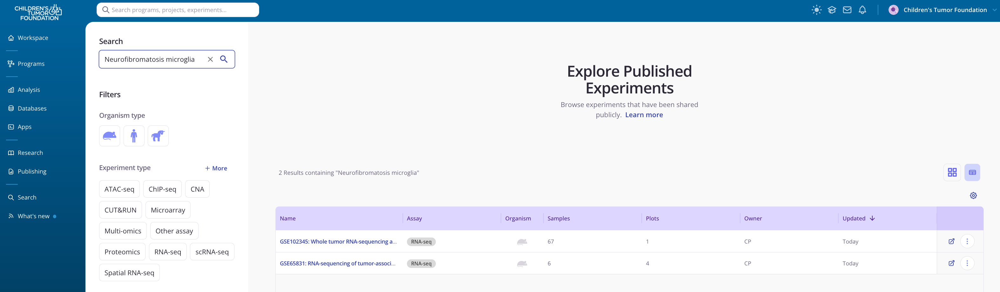

Click on one of these experiments to learn more about the data they contain. Have a glance at the Notebook section to learn more about the dataset and experimental design. These are examples of public data experiments, which typically already contain some analyses and visualizations. See which analyses were already performed on this dataset by clicking **Analysis > Grid** tab at the top of the page. 

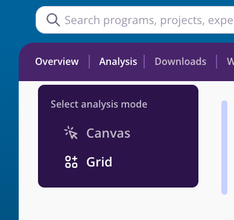

Then, you can navigate back to the published data sets page to find other datasets of interest or continue on to the next step. 

## Step 3: Find a specific NF dataset

In this workshop, we will be exploring a specific public dataset from the NF Data Portal. By now, you should have access to the CTF external project. See the projects you have access to using the **Analysis > Projects** tab in the left-hand menu or by using this [link](https://app.pluto.bio/projects). 

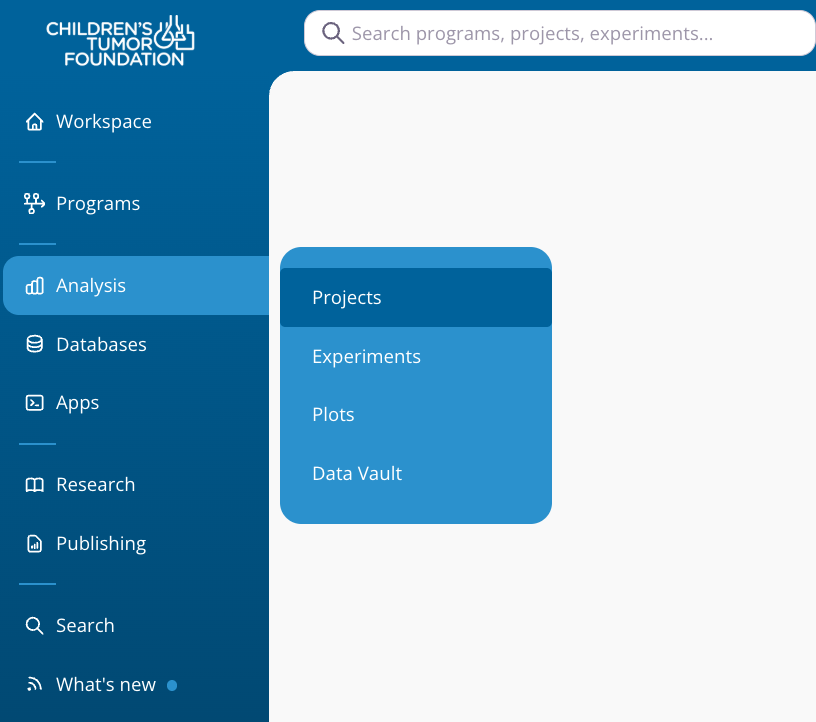

Click on the project entitled "CTF NF Target Discovery Hub - External". If you **do not** see this project, it means you have not yet been added to this CTF project. Please contact one of the workshop organizers to let them know. 

You will see a number of experiments to analyze within this project. For this workshop, click on the dataset entitled "Human NF1 Low Grade Glioma RNAseq Data" or use this [link](https://app.pluto.bio/experiments/PLX312906). 

The main experiment page can be used to view the experiment notebook, sample metadata, counts data, and pipeline QC results. View the current analysis of this experiment using the **Analysis > Grid** tab at the top of the page or using this [link](https://app.pluto.bio/experiments/PLX312906/analysis). 

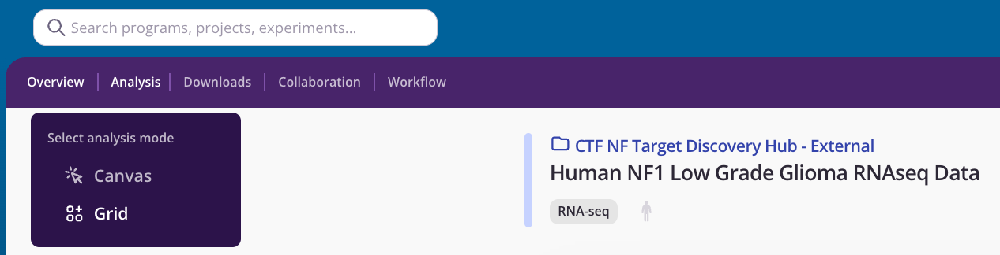

Existing analyses include a differential expression comparison and a principal component analysis (PCA). We can create our own analyses by continuing to the next step! 

## Step 4: Run a differential expression analysis 

Click the **Exploratory Analysis** button to open the analysis catalog. Here, you will see all of the no-code analysis options that are available for this experiment. You can search for a particular analysis to filter by category.

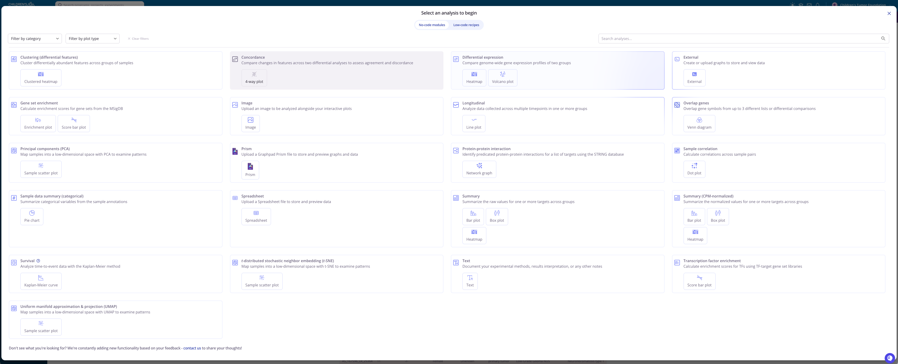

Select the **Differential expression** analysis. The page at the right describes this particular analysis in detail. Click the **create analysis** button. 

You will now begin customizing your own analysis. Here, you will select a variable to group your samples by for differential expression analysis. To follow along with the workshop, select the "Nf1 Genotype" variable. 

In the dropdown menu for experimental group, select the label "-/-" indicating homozygous loss of the gene, NF1. In the dropdown menu for control group, select the label "+/-" indicating heterozygous loss of NF1. Click **Run analysis** to begin running your differential expression analysis. 

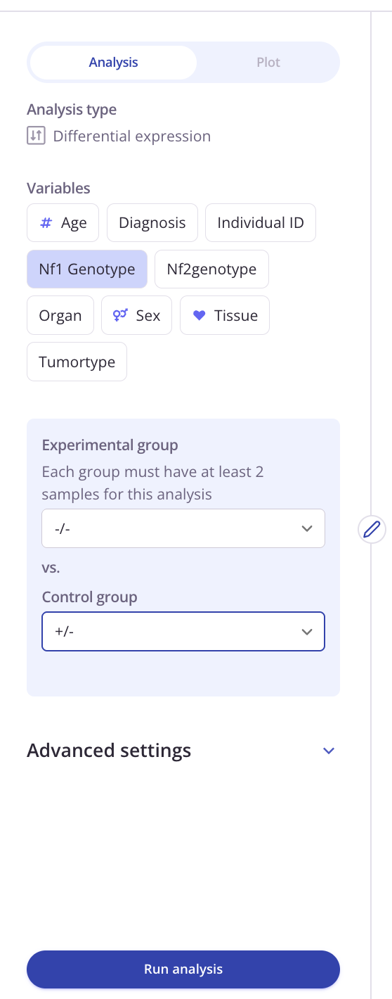 

Once the analysis appears, you can customize the plot filters, colors, and highlighted features by clicking on the **Plot** tab. 

In this volcano plot, the significantly increased genes in the -/- (homozygous) group relative to the +/- (heterozygous) group have a positive log2 fold change and significant adjusted p-values. On the other hand, the significantly decreased genes in the homozygous group relative to the heterozygous group have *negative* log2 fold changes, and are on the left side of the x-axis. 

Click a circle around a few points on the plot to lasso a group of genes. That group of genes will then be highlighted and labeled for quick reference. The are named in the plot settings under "Labeled features" for reference. 

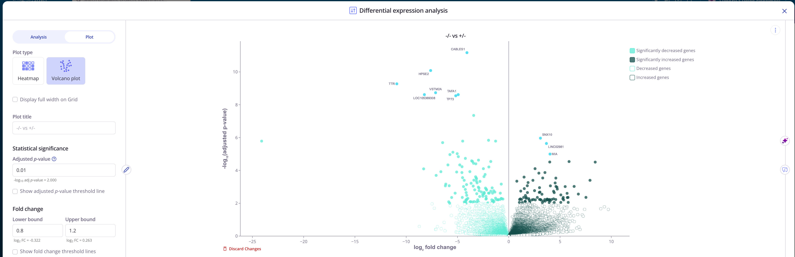

In Pluto, all analyses have results and methods tabs under the plot: 

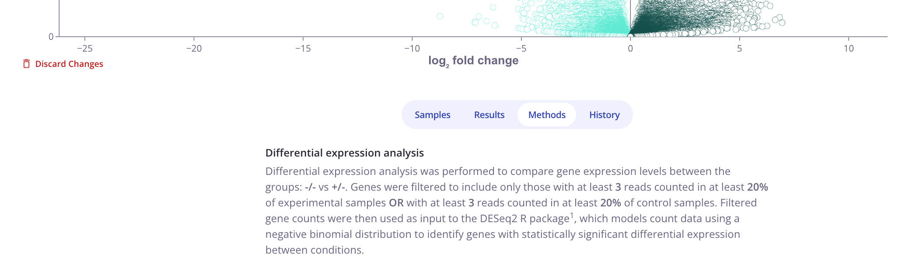 

You can also export plots which will lead to a customization page, allowing additional edits before publication! 

**This is a particularly import step because your current trial period means that all analyses will be removed after 24 hours.**

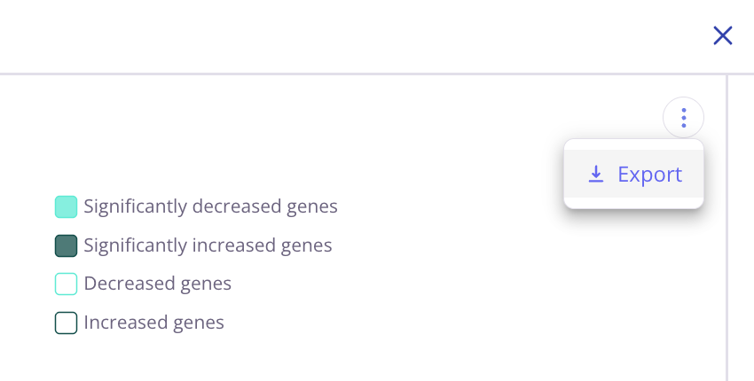 

## Step 5: Run pathway analysis 

Now that we made a differential expression comparison in the previous step, we have dozens of significantly different genes. These can be difficult to hold in your head all at once while trying to make sense of what they biologically mean collectively. 

We will run pathway analysis to get a better sense of how the biology differs between homozygous and heterozygous NF1 loss. 

Click the **Exploratory Analysis** button to return to the analysis catalog. Select **Gene set enrichment** and **create analysis**. Choose your newly created comparison, "-/- vs +/-", and select "Hallmarks" as the Gene set collection. Click **Run analysis** to start GSEA. 

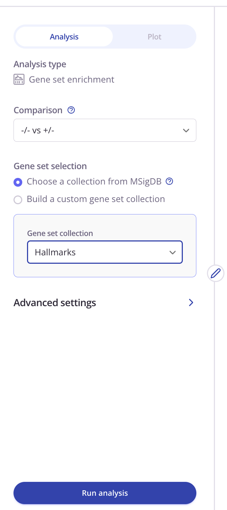 

Click on the **Plot** tab when the analysis finishes. You'll see the most significant gene set, interferon gamma response, as the displayed enrichment plot. The enrichment plot shows where genes in this pathway fall in your ranked fold-change from the -/- vs +/- comparison. The majority of these genes fall into the positive fold change category, meaning that -/- samples have a stronger signal for interferon gamma response. 

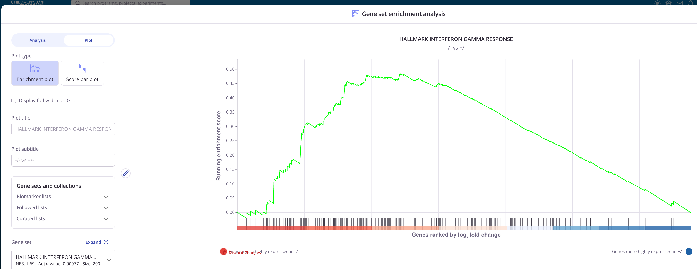 

You can use the **Gene set** dropdown to view other gene sets or select the **Score bar plot** option to view multiple gene sets at once. 

When the adjusted p-value cutoff is raised to 0.01, you'll notice multiple gene sets related to immune response, suggesting higher inflammation in the -/- samples. This finding is consistent with literature showing loss of NF1 enhances inflammation (PMID: 28001089).  

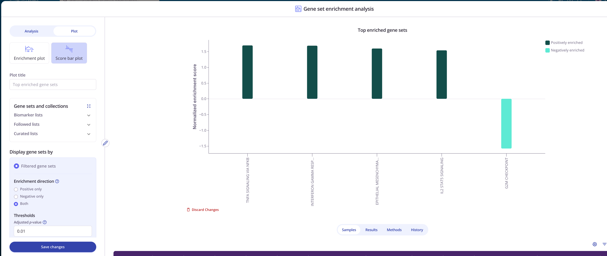 

## Step 6 (optional): Run additional analysis 

Time permitting, feel free to run additional analyses or explore other NF and public datasets. 

## Wrap up 

Thank you for joining this data workshop to analyze NF Portal Datasets on Pluto! 

Today, you have learned how to search for NF Data Portal datasets in Pluto projects or public data sets and how to run no-code analyses to generate custom data visualizations. We have also walked through how you can explore plots more deeply through additional plot settings, results, and methods. 

To continue working in Pluto, [please contact Kara Quaid for extended access](https://www.ctf.org/pluto-web-access/). If you have any questions about
Pluto, don't hesitate to reach out the Andrew Goodspeed (andrew@pluto.bio), Mea Casey (mea@pluto.bio), or the Pluto Support team (support@pluto.bio). 

